### 주제: CarDekho 사이트에 올라온 중고차 가격 회귀 예측
- CarDekho는 인도의 중고차 관련 웹 사이트


---

#### Features (총 65개)


#### Targets
- listed_price: 판매 사이트에 제시된 가격

---

### 데이터 전처리

아래 과정에 앞서, 분석에 불필요한 feature(id, 자동차 사진 등)는 삭제

데이터 세트 확인 결과 다수의 feature에서 결측치가 확인되었으며,  
심한 것은 전체 약 37,000개 중 단 500개 정도만이 채워져있었음

따라서 각 컬럼의 특성에 따라 결측치 조정


#### 결측치 조정
- 결측치 비율이 10%(3700개) 미만인 컬럼들은 결측치 삭제
- 10% 이상이면 대체(평균 or 중간값 or 최빈값)

- 현재 10% 이상의 결측치가 발견된 컬럼은 Drive Type과 Fuel Suppy System을 제외하고 모두 수치형

- 순서
> 1. 결측치 10% 미만 컬럼 결측치 삭제
> 2. Drive Type, Fuel Suppy System 결측치 조정
> 3. 결측치 10% 이상 컬럼 결측치 조정
> 4. 레이블 인코딩


각 컬럼의 결측치 수를 확인, 결측치가 전체(약 37,000개)의 10% 미만인 컬럼들은  
전부 결측치 삭제를 진행, 그 결과 약 28,000개의 데이터가 유지됨

결측치가 10% 이상인 컬럼들 중, 데이터 타입이 문자형인 Drive Type과 Fuel Suppy System은  
이번 프로젝트에선 결측치를 제거하기로 결정하여, 위와 마찬가지로 결측치를 제거함

그 후, 결측치 10% 이상인 수치형 컬럼들을 decsribe()로 평균과 중간값을 확인해 본 결과,  
해당 컬럼들의 평균과 중간값이 거의 비슷한 것을 확인

그 중 중앙값이 대부분 정수값을 보였기 때문에,   
이번 프로젝트에서는 중앙값으로 결측치를 대체

결측치 대체 후, 중복되는 데이터가 일부 발생했기 때문에 중복 데이터를 제거함


#### 레이블 인코딩
- 문자열 feature들은 전부 레이블 인코딩 후, 데이터 타입을 정수형으로 변경함 


#### 표준화 후 이상치 제거

위에서 레이블 인코딩한 컬럼들을 제외한 나머지는 StandardScaler를 적용한 뒤,  
-1.96 ~ 1.96 범위를 벗어나는 값들은 전부 제거


위 과정이 끝난 다음, 타겟의 데이터 분포를 시각화한 결과는 다음과 같음

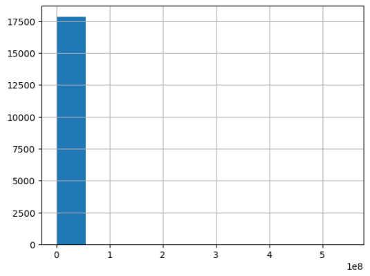

그래프가 한쪽으로 쏠려있었기 때문에, describe()로 수치 데이터를 확인

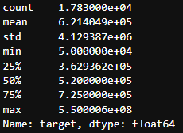

위 현상의 원인이 비정상적으로 높은 최대값 때문인 것을 알게 됨

따라서 타겟 값이 200만 이상인 데이터 제거 후 인덱스 초기화를 해주었고,
이후 타겟값에 로그를 취하기 전후의 데이터 분포를 시각화함

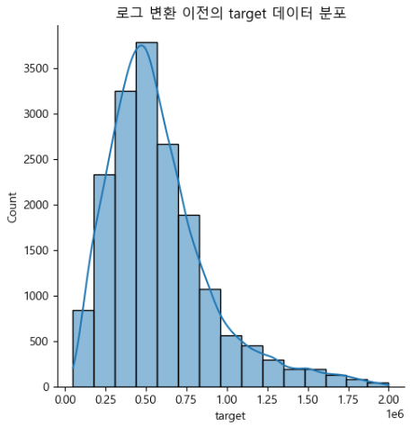

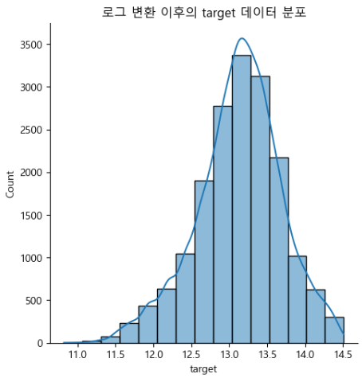

이후 skew()로 로그 변환 전후의 왜도를 출력했고,  
로그 변환 전후의 왜도 비교 결과, 변환 후 왜도가 낮아진 것을 확인  
따라서 타겟 값에 로그를 취하기로 결정

본격적인 학습에 앞서, 타겟과 다른 feature들의 상관관계와  
feature 사이의 상관관계를 시각화

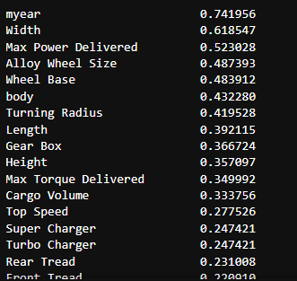

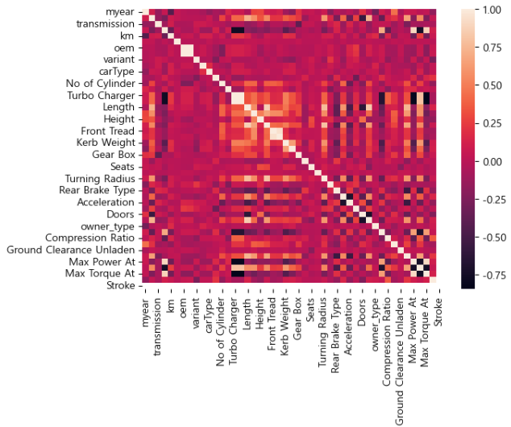

---

### 1st Cycle - 차원 축소 없이 선형 회귀
- PCA 차원 축소 후 결과와 비교 분석

```
from sklearn.model_selection import train_test_split
from sklearn.linear_model import LinearRegression

# 데이터 세트 분할 후 선형 회귀 모델로 훈련
features, targets = pre_c_df.iloc[:, :-1], pre_c_df.iloc[:, -1]

X_train, X_test, y_train, y_test = \
train_test_split(features, targets, test_size=0.2, random_state=124)

l_r = LinearRegression()
l_r.fit(X_train, y_train)
```

위 코드로 데이터 세트 분할 후, Sklearn의 LinearRegression으로 선형 회귀 진행

```
from sklearn.metrics import mean_squared_log_error, mean_squared_error, r2_score

# 선형 회귀 모델의 평가 지표(R2 점수 포함)를 출력해주는 함수
def get_evaluation(y_test, prediction):
    MSE = mean_squared_error(y_test, prediction)
    RMSE = np.sqrt(MSE)
    MSLE = mean_squared_log_error(y_test, prediction)
    RMSLE = np.sqrt(mean_squared_log_error(y_test, prediction))
    R2 = r2_score(y_test, prediction)
    print('MSE: {:.4f}, RMSE: {:.4f}, MSLE: {:.4f}, RMSLE: {:.4f}, R2: {:.4f}'\
          .format(MSE, RMSE, MSLE, RMSLE, R2))
```

위의 함수로 회귀 모델의 평가를 준비한 뒤,

```
import matplotlib.pyplot as plt

# 모델 훈련 후 train 데이터 예측하고 평가
l_r.fit(X_train, y_train)
prediction = l_r.predict(X_train)
get_evaluation(y_train, prediction)

# train 데이터 분포 시각화
fig, ax = plt.subplots()

# 실제값과 예측값에 따른 분포를 산점도로 시각화
ax.scatter(y_train, prediction, edgecolors='red', c='orange', alpha=0.2)

# y = x 그래프를 점선으로 시각화
ax.plot([y_train.min(), y_train.max()], [y_train.min(), y_train.max()], 'k--')
plt.title('1st Cycle - train - 선형 회귀')
plt.show()
```

```
import matplotlib.pyplot as plt

# 같은 모델로 test 데이터 예측 결과 시각화
l_r.fit(X_train, y_train)
prediction = l_r.predict(X_test)
get_evaluation(y_test, prediction)

fig, ax = plt.subplots()
ax.scatter(y_test, prediction, edgecolors='red', c='orange', alpha=0.2)
ax.plot([y_test.min(), y_test.max()], [y_test.min(), y_test.max()], 'k--')
plt.title('1st Cycle - test - 선형 회귀')
plt.show()
```

train과 test 데이터에 대한 예측 성능 평가 결과를 시각화하고,
결과를 비교함으로서 과적합 발생 여부도 확인

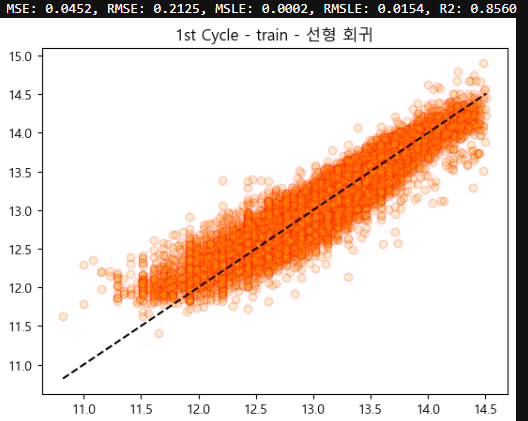

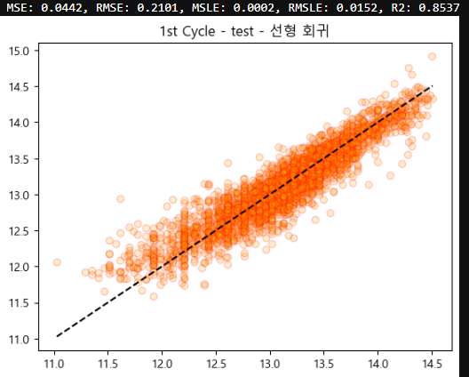


#### 1st Cycle - 차원 축소 없이 선형 회귀한 결과
- train 데이터와 test 데이터의 R2와 오차가 큰 차이를 보이지 않음
- 따라서 현재 모델에는 과적합이 발생하지 않은 것으로 추정

---

### 1st Cycle - 차원 축소
- 차원 축소 이전에도 만족스러운 결과를 보였지만,  
  학습에 사용된 feature의 개수가 많기 때문에 모델의 계산 효율에 악영향을 줄 수 있음
- 따라서 표현력 손실을 감수하더라도 차원 축소를 통해 계산 효율을 향상
- 현재 타겟이 연속형 데이터이기 때문에 차원 축소는 PCA 방식으로만 진행


위 과정에서 분할한 데이터 세트를 pandas의 concat()으로   
train과 test 데이터를 각각 병합해서 train_df와 test_df를 생성,

이후 PCA()로 위 데이터 세트를 차원 축소한 뒤,  
차원 축소된 데이터 세트 pca_train_df와 pca_test_df로 학습과 평가 진행


#### 1st Cycle - 2차원으로 차원 축소

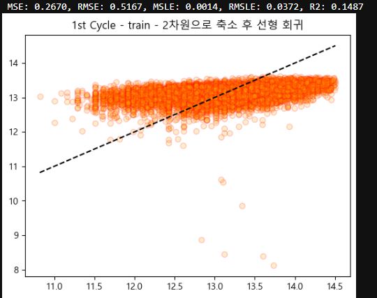

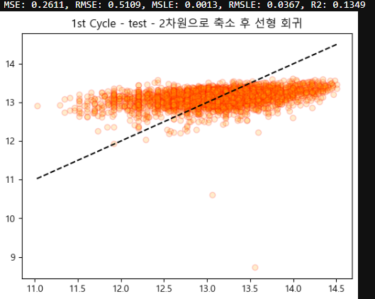


#### 1st Cycle - 5차원으로 차원 축소

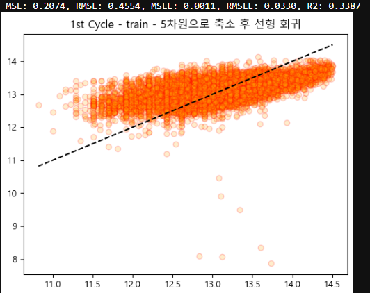

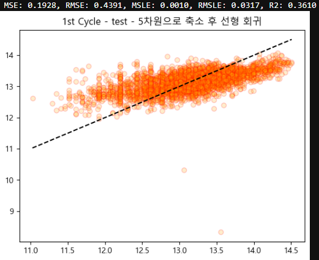


#### 1st Cycle - 8차원으로 차원 축소

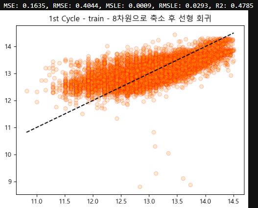

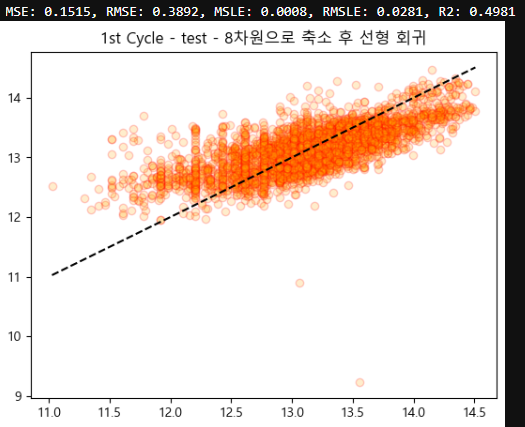

---

각 차원 별 결과를 바 플롯으로 시각화한 결과는 다음과 같음

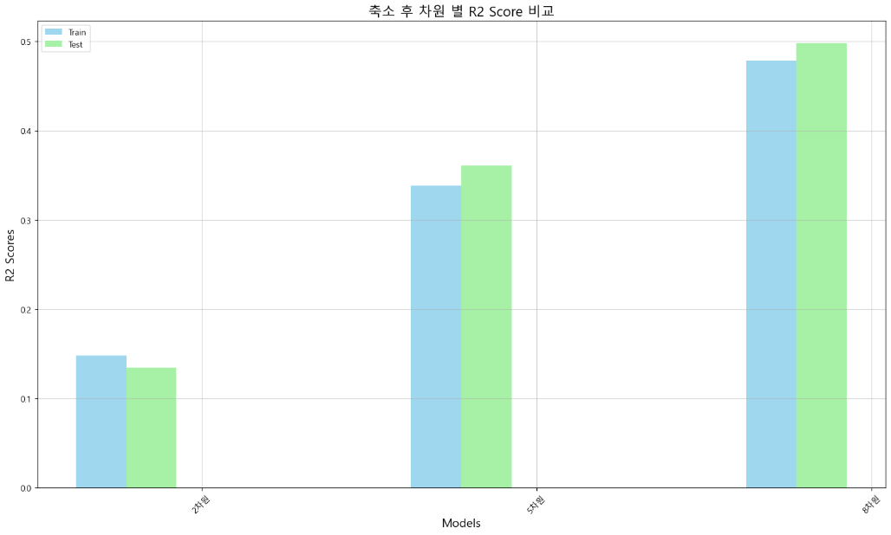


---

#### 1st Cycle - PCA 방식으로 차원 축소 후 Sklearn 선형 회귀 모델 학습 결과
- 차원 수를 8로 늘렸지만, R2는 0.5 미만으로  
  여전히 차원 축소 이전에 비해 심각하게 감소한 경향을 보임
- Pytorch로 차원 축소 이후 데이터 세트 학습 후, 위 과정에서 사용한 Sklearn과의 결과 비교

---

### 1st Cycle - Pytorch를 이용한 선형 회귀
- 데이터 세트는 위 과정으로 만들어진 pca_train_df와 pca_test_df 사용

```
from torch.nn import Module, Linear

# LinearRegressionModel 클래스 선언
class LinearRegressionModel(Module):
    # 클래스 실행 시, 매개변수 n을 전달받음
    def __init__(self, n):
        # 부모 클래스(torch.nn.Module) 실행
        super().__init__()
        # linear 재정의 - 전달받은 n 만큼 차원 설정
        self.linear = Linear(n, 1)

    # LinearRegressionModel.forward 사용 시
    def forward(self, x):
        # 위에서 재정의한 linear에 전달받은 x값 넣어서 실행
        return self.linear(x)
```

선형 회귀 모델로 사용할 별도의 클래스를 생성 후

```
import torch
from torch.optim import SGD
from torch.nn.functional import mse_loss
from sklearn.model_selection import train_test_split
import numpy as np

# torch의 시드값 고정
torch.manual_seed(124)

# 데이터 세트 분할 후 Tensor 타입으로 변경
# y(정답) 데이터 세트들은 ndarray 타입이기 때문에 view를 사용해서 차원 변환
X_train = torch.FloatTensor(pca_train_df.iloc[:, :-1].values)
y_train = torch.FloatTensor(pca_train_df.target.values).view(-1, 1)
X_test = torch.FloatTensor(pca_test_df.iloc[:, :-1].values)
y_test = torch.FloatTensor(pca_test_df.target.values).view(-1, 1)

# 위 셀에서 정의한 클래스 객체 선언(8차원)
l_r = LinearRegressionModel(8)

optimizer = SGD(l_r.parameters(), lr=6e-10)

# 반복 횟수
epochs = 100000

for epoch in range(1, epochs + 1):
    H = l_r(X_train)
    loss = mse_loss(y_train, H)

    optimizer.zero_grad()
    loss.backward()
    optimizer.step()

    if epoch % 10000 == 0:
        print(f'Epoch: {epoch}/{epochs}')
        for i, w in enumerate(list(l_r.parameters())[0][0]):
            print(f'W{i + 1}: {np.round(w.item(), 4)}, ', end='')
        print(f'b: {np.round(list(l_r.parameters())[1].item(), 4)}')
        print(f'loss: {np.round(loss.item(), 4)}')
        print('=' * 60)
```

위 코드로 학습을 진행한 결과

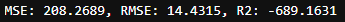

위와 같이 비정상적인 결과가 도출됨

---

#### 1st Cycle - 학습 결과
- 차원 축소 시, 차원 축소 이전에 비해 R2가 심각하게 감소하는 현상 발생
- 피드백 결과, 이는 차원 축소 이전 target과의 연관성이 낮은 feature들을 제거하지 않아서 생긴 문제라는 것을 알게 됨
- 따라서 다음 사이클에서는 target과의 연관성이 낮았던 feature들을 제거한 다음 학습

---

### 2nd Cycle - 데이터 전처리
- target과의 상관관계가 0.5 이하인 컬럼들을 전부 제거한 다음, 차원 축소 유무에 따른 학습 결과 비교

```
# 타겟과의 상관관계를 변수에 할당(pandas.Series 타입)
target_corr = pre_c_df.corr()['target'].sort_values(ascending=False)[1:]

# 상관관계 0.5이하인 컬럼만 담을 빈 리스트 선언
low_columns = []

# Series에는 딕셔너리와 유사하기 때문에 keys로 각 컬럼명 불러오는 것이 가능
for column in target_corr.keys():
    if (target_corr[column] <= 0.5) & (target_corr[column] >= -0.5):
        low_columns.append(column)

# 상관관계 0.5 이하인 feature만 담긴 리스트 출력
low_columns
```

우선 위 코드로 타겟과의 상관관계가 0.5 이하인 feature들을 리스트에 담은 뒤 해당 feature들을 제거  

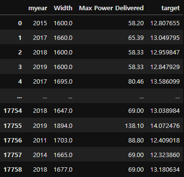

그 결과, 위와 같이 남은 feature가 3개였기 때문에  
이번 사이클에서는 차원 축소를 진행하지 않음

---

### 2nd Cycle - 선형 회귀

이전 사이클과 동일한 과정을 거쳐서  
train과 test 데이터를 예측한 결과는 다음과 같음

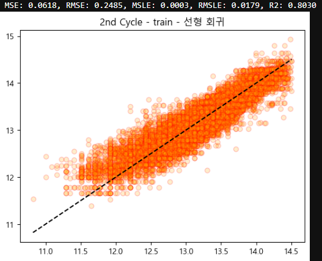

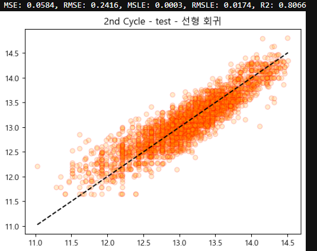


#### 2nd Cycle - 선형 회귀 결과
- 이전 사이클과 마찬가지로, train 데이터와 test 데이터의 R2와 오차가 큰 차이를 보이지 않음
- 따라서 현재 모델에는 과적합이 발생하지 않은 것으로 추정되며,  
  R2는 약 0.8 정도로 우수한 성능을 보임

---

### 2nd Cycle - 다항 회귀 모델로 회귀
- 별도의 차원 축소 없이 현재 데이터 세트를 그대로 사용하여 Polynomial로 다항 회귀 진행
- 만약 이 과정과 트리 모델 학습 결과가 선형 모델에 비해 아쉬운 결과를 보인다면,  
  처음 방식대로 pre_c_df의 차원 축소를 통한 학습도 고려

이번 프로젝트에서는 다항식의 차수를 2 ~ 6차까지 올려보면서 학습했으며,  
그 결과는 다음과 같음

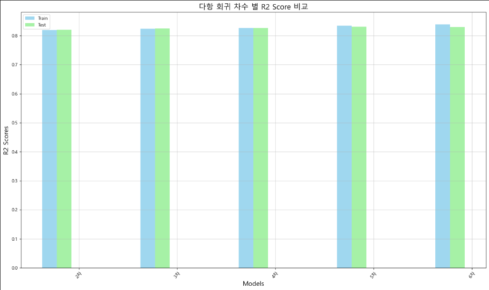

#### 2nd Cycle - 다항 회귀 모델 학습 결과
- 회귀선의 차수를 6차까지 올려본 결과, 차수가 올라갈 수록 모델의 성능 역시 향상됨
- 다만, 회귀선의 차수가 5차를 넘어갔을 때부터 test 데이터 예측 결과가  
  train 데이터에 비해 낮아진 현상 역시 발견되었고, 이는 해당 시점부터 과적합 경향이 강해진 것으로 추정

---

### 2nd Cycle - 비선형 트리 모델로 회귀
- Decision Tree, Random Forest, Gradient Boosting, XGB, LightGBM 모델로 학습 후 각 모델의 결과 비교
- 위 과정으로 생성한 poly_features와 병행하지 않고, 원래의 features로 데이터 분할

다항 회귀와 마찬가지로 바 플롯으로 각 모델 별 train과 test 데이터를 예측한 뒤,
각각의 R2를 시각화한 결과 아래의 결과를 보임

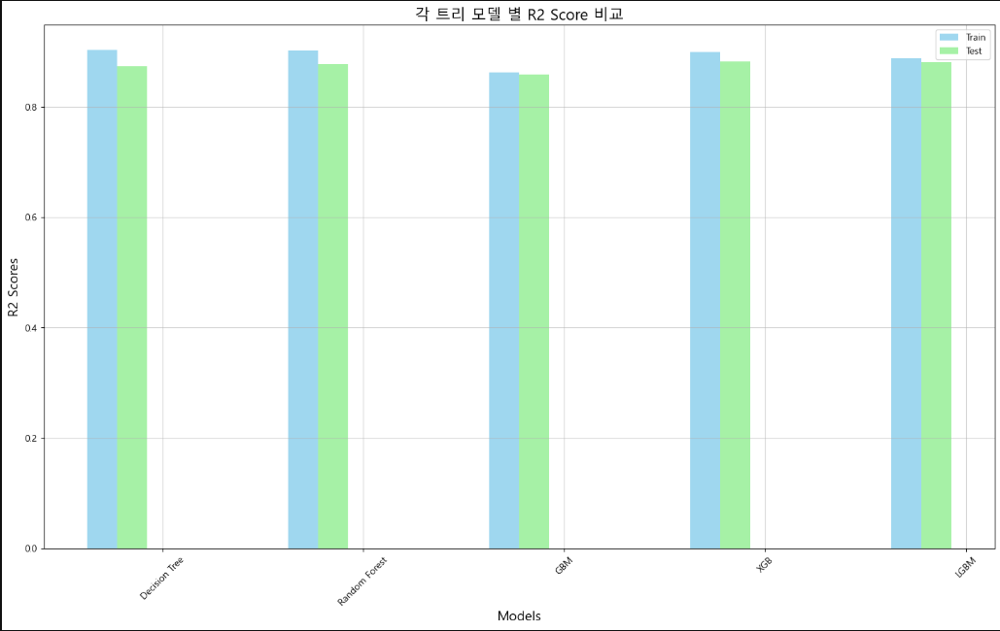


#### 2nd Cycle - 비선형 트리 모델 회귀 결과
- 현재 test 데이터에 대한 예측 성능이 가장 우수한 것은 XGB 모델로, 약 0.87 정도의 R2 Score를 기록함

- train과 test 데이터의 학습 결과에서 가장 적은 차이를 보인 것은 Gradient Boosting 모델로,  
  test 데이터 예측 결과의 R2는 이번에 사용한 모델 중 가장 낮은 약 0.85를 기록함

---

#### 2nd Cycle - 학습 결과
- 상관관계가 낮은 feature들을 제거함으로서 우수한 지표를 가진 모델이 만들어졌지만,  
  전처리 과정에서 중요한 feature들이 다수 소실됨
- 따라서 다음 사이클에서는 소실되었던 feature들 중 중요한 feature들을 하나씩 추가,  
  화이트 노이즈(편향)를 발생시켜 R2를 0.8 근처로 조정하는 것을 목표로 할 것

---

### 3rd Cycle - 데이터 전처리
- 이전 사이클에서 소실된 feature 중 일부를 복구

- 복구할 feature의 기준
> - 기존 또는 추가할 feature들과 의미가 중첩되지 않는 feature
> - 그 외, 중고차 가격 분석에 필요할 것이라 생각되는 feature

- 이 과정 이후, 차원 수가 7 이상이 되면 PCA 방식으로 차원 축소 실행
> - 첫 사이클에 비해 feature 수가 많이 줄어든 상태이기 때문에 차원 축소 전후의 R2는 큰 변동이 없을 것으로 기대

---

### 3rd Cycle - 복구할 feature들
- 상관관계와 feature의 의미를 검토하여, pre_c_df에서 가져와 복구할 feature 7개를 선정
> - Cargo Volume: 차량 내 적재 공간
> - Top Speed: 최고 속도 (km/h)
> - transmission: 변속기 종류 (자동, 수동 등)
> - owner_type: 차량의 이전 소유주 수
> - fuel: 연료 (휘발, 경유, 천연가스 등)
> - Valves per Cylinder: 엔진 내 실린더 하나 당 밸브 수
> - utype: 판매자 유형 (딜러 / 개인)

- 위 feature들을 하나씩 추가, 이전 사이클에서 가장 우수한 결과를 보인 트리 모델로 학습시켜 결과의 변화 추이 분석

위의 feature들을 하나씩 추가하면서 각각의 R2를 측정했으며,  
owner_type을 추가할 때부터는 차원 수가 7 이상이 되었기 때문에 해당 시점부터는 차원 축소도 병행했고,
각 feature가 추가될 때마다 R2를 측정한 결과는 다음과 같음

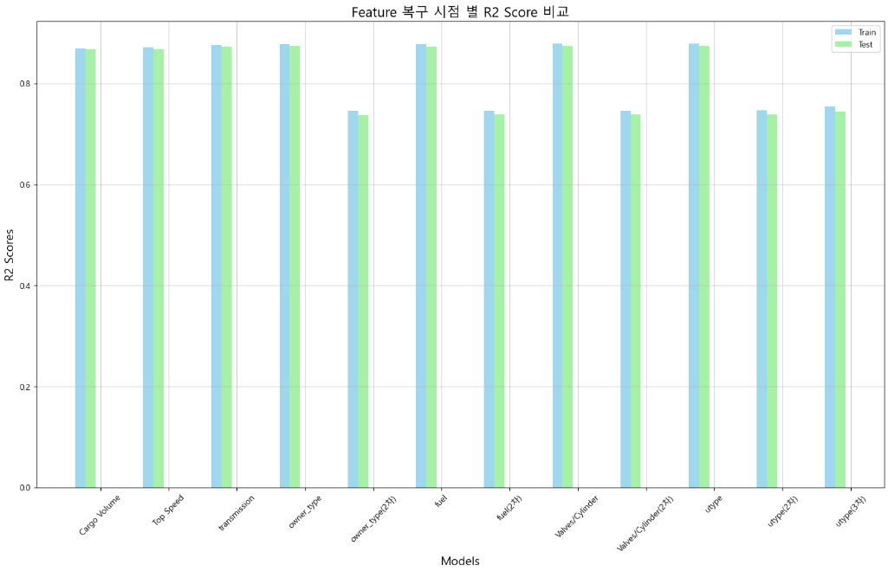

---

### 최종 학습 결과
- feature 복구 후 feature(차원) 수가 7개 이상이 되었을 때부터 차원 축소를 실행한 결과  
  마지막 utype까지 추가 한 뒤 3차원으로 차원 축소 했을 때,  
  train과 test 데이터 사이의 R2 Score 차이는 미미했으며, 오차는 거의 차이가 나지 않았다.

- 다만 이 때 test 데이터의 R2 Score는 약 0.74로,  
  feature 복구 이전의 R2 Score였던 0.85에 비해 상당히 낮아진 것이 확인되었다.

