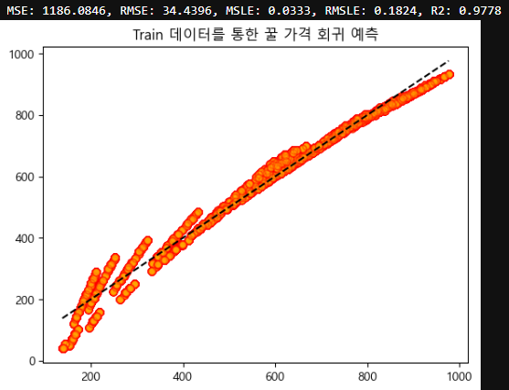

### 주제: 선형 회귀 모델을 통한 꿀 가격 예측 모델 학습


<sub>출처: https://www.harniva.com/about-honey</sub>

---

#### Features (총 10종)
- CS: 색깔 (Color Score)
> - 점수가 낮을수록 밝은 색, 높을수록 어두운 색을 띄는 꿀

- Density: 밀도
- WC: 수분 함유량 (Water Content)
- pH
- EC: 전기 전도도 (Electrical Conductivity)
- F: 과당 함유량 (Fructose level)
- G: 포도당 함유량 (Glucose level)
- Pollen_analysis: 밀원식물 종류
> - Clover, Wildflower, Orange Blossom 등을 포함한 총 19종의 고유 클래스

- Viscosity: 점도 (단위는 centipoise)
> - 특이사항: 2500 ~ 9500 사이의 값은 아래의 Purity에 최적인 것으로 간주됨

- Purity: 순도

#### Targets
- Price: 가격

---

우선 데이터 세트를 불러왔으며, 안에 포함된 데이터는 아래와 같음


### 데이터 전처리 

결측치와 중복을 확인해보았지만, 이번 데이터 세트에서는 발견되지 않음

따라서, 문자열 데이터인 Pollen_analysis를 제외한 나머지 컬럼들의 데이터를 StandardScaler로 표준화 후 이상치 제거

```
from sklearn.preprocessing import StandardScaler

# StandardScaler 객체 선언
std = StandardScaler()

# Pollen_analysis를 제외한 나머지 컬럼만 담긴 새로운 데이터 세트 생성
except_pa_df = pre_h_df.drop(labels=['Pollen_analysis'], axis=1)

# Pollen_analysis를 제외한 나머지 데이터가 표준화 된 수치가 담긴 데이터 세트를 새로 생성
result = std.fit_transform(except_pa_df)

std_pre_h_df = pd.DataFrame(result, columns=except_pa_df.columns)

condition = True

# 반복문으로 각 컬럼에서 -1.96 ~ 1.96 사이의 행만 가져오는 조건식 생성
for column in std_pre_h_df.columns:
    condition &= std_pre_h_df[column].between(-1.96, 1.96)

# 위 조건에 맞지 않는 행 삭제
std_pre_h_df = std_pre_h_df[condition]

# 전처리용 데이터 세트에서 이상치가 없는 행만 유지하고 인덱스 초기화
pre_h_df = pre_h_df.iloc[std_pre_h_df.index].reset_index(drop=True)
pre_h_df

```

표준화 후의 데이터 분포를 시각화한 결과는 다음과 같음


모델의 성능 향상을 위해 타겟에 로그를 취한 뒤의 데이터 분포도 시각화 해보았으나,  
아래와 같은 결과를 보였기에 로그를 따로 취하지 않기로 결정


---

#### 원핫 인코딩
- 범주형 문자열 데이터가 담긴 Pollen_analysis를 원핫 인코딩
- 원핫 인코딩을 하는 이유는 클래스 간 순서가 없기 때문

```
from sklearn.preprocessing import OneHotEncoder

# sparse_output=False: ndarray 타입으로 리턴
# sparse_output=True: 희소 행렬로 리턴
one_hot_encoder = OneHotEncoder(sparse_output=False)

# 원핫 인코더로 fit 할 때, 데이터프레임 형태로 전달
result = one_hot_encoder.fit_transform(pre_h_df[['Pollen_analysis']])

# 원핫 인코더의 categories_: 레이블 인코더의 classes_ 같은 기능
one_hot_encoder.categories_

# 전처리용 데이터 세트에 원핫 인코딩 한 데이터 병합
pre_h_df = pd.concat([pre_h_df,
                     pd.DataFrame(result, columns=one_hot_encoder.categories_).astype(np.int8)],
                     axis=1)

# 불필요해진 Pollen_analysis 컬럼 삭제
pre_h_df = pre_h_df.drop(labels=['Pollen_analysis'], axis=1)

# 원핫 인코딩 한 컬럼명 변경
pre_h_df.columns = ['CS', 'Density', 'WC', 'pH', 'EC', 'F', 'G', 'Viscosity', 'Purity', 'Price',
                    'Acacia', 'Alfalfa', 'Avocado', 'Blueberry', 'Borage', 'Buckwheat',
                    'Chestnut', 'Clover', 'Eucalyptus', 'Heather', 'Lavender',
                    'Manuka', 'Orange Blossom', 'Rosemary', 'Sage', 'Sunflower',
                    'Thyme', 'Tupelo', 'Wildflower']

# Target 데이터를 맨 끝 컬럼으로 이동
pre_h_df.loc[:, 'Target'] = pre_h_df.Price
pre_h_df = pre_h_df.drop(labels=['Price'], axis=1)
pre_h_df
```

위 코드 실행 이후 Pollen_analysis의 클래스 수(19개) 만큼의 feature가 새로 생성되었으며,  
이후의 데이터 세트는 아래와 같음


이후 feature들 사이의 상관관계를 히트맵으로 시각화,  
아래와 같은 결과를 보임에 따라 현재 feature들 사이의 상관관계가 거의 없다는 사실을 알아냄


---

### 1st Cycle - 선형 회귀 모델 학습


```
from sklearn.model_selection import train_test_split
from sklearn.linear_model import LinearRegression

# 데이터 세트 분할 후 선형 회귀 모델로 훈련
features, targets = pre_h_df.iloc[:, :-1], pre_h_df.iloc[:, -1]

X_train, X_test, y_train, y_test = \
train_test_split(features, targets, test_size=0.2, random_state=124)

l_r = LinearRegression()
l_r.fit(X_train, y_train)
```

전처리를 완료한 데이터 세트를 분할, Sklear의 LinearRegression으로 훈련하고,

```
from sklearn.metrics import mean_squared_log_error, mean_squared_error, r2_score

# 선형 회귀 모델의 평가 지표(R2 점수 포함)를 출력해주는 함수
def get_evaluation(y_test, prediction):
    MSE = mean_squared_error(y_test, prediction)
    RMSE = np.sqrt(MSE)
    MSLE = mean_squared_log_error(y_test, prediction)
    RMSLE = np.sqrt(mean_squared_log_error(y_test, prediction))
    R2 = r2_score(y_test, prediction)
    print('MSE: {:.4f}, RMSE: {:.4f}, MSLE: {:.4f}, RMSLE: {:.4f}, R2: {:.4f}'\
          .format(MSE, RMSE, MSLE, RMSLE, R2))

# 테스트 데이터 예측 후 평가
prediction = l_r.predict(X_test)

get_evaluation(y_test, prediction)
```

위 함수를 선언 및 사용하여 모델 성능을 평가해본 결과,  
R2 Score가 약 0.98에 근접한 모델이 만들어졌다는 것을 확인


---

#### 과적합 발생 여부 확인 - validation 데이터
- train 데이터 세트 만들고 다시 분할해서 validation 데이터 세트 생성
- validation 데이터 세트를 선형 회귀 모델로 학습한 뒤, test 데이터의 R2와 비교

우선 X_train과 y_train을 pandas의 concat() 메소드로 병합하여 train_df를 생성


```
from sklearn.model_selection import train_test_split
from sklearn.linear_model import LinearRegression

# train 데이터 세트 분할 후 선형 회귀 모델로 훈련
validation_features, validation_targets = train_h_df.iloc[:, :-1], train_h_df.iloc[:, -1]

X_va_train, X_va_test, y_va_train, y_va_test = \
train_test_split(validation_features, validation_targets, test_size=0.2, random_state=124)

l_r = LinearRegression()
l_r.fit(X_va_train, y_va_train)
```

이를 위의 선형 회귀 때와 같은 방식으로 분할하여 validation 데이터를 생성했으며  
X_va_test를 예측한 뒤 평가한 결과, test 데이터와 R2와 오차의 차이가 크지 않은 것을 확인


따라서 현재 모델에는 과적합이 발생하지 않았다는 사실을 알 수 있었음

---

#### 과적합 발생 여부 확인 - train, test 데이터 예측 결과 시각화

```
import matplotlib.pyplot as plt

# 폰트를 맑은 고딕으로 설정하고 한글 깨짐 방지
plt.rcParams['font.family'] ='Malgun Gothic'
plt.rcParams['axes.unicode_minus'] =False

# 모델 훈련 후 train 데이터 예측하고 평가
l_r.fit(X_train, y_train)
prediction = l_r.predict(X_train)
get_evaluation(y_train, prediction)

# train 데이터 분포 시각화
fig, ax = plt.subplots()

# 실제값과 예측값에 따른 분포를 산점도로 시각화
ax.scatter(y_train, prediction, edgecolors='red', c='orange', alpha=0.2)

# y = x 그래프를 점선으로 시각화
ax.plot([y_train.min(), y_train.max()], [y_train.min(), y_train.max()], 'k--')
plt.title('Train 데이터를 통한 꿀 가격 회귀 예측')
plt.show()
```

```
import matplotlib.pyplot as plt

# 같은 모델로 test 데이터 예측 결과 시각화
l_r.fit(X_train, y_train)
prediction = l_r.predict(X_test)
get_evaluation(y_test, prediction)

fig, ax = plt.subplots()
ax.scatter(y_test, prediction, edgecolors='red', c='orange', alpha=0.2)
ax.plot([y_test.min(), y_test.max()], [y_test.min(), y_test.max()], 'k--')
plt.title('Test 데이터를 통한 꿀 가격 회귀 예측')
plt.show()
```

위 코드로 train, test 데이터를 같은 모델로 예측,
y = x로 기준선을 그리고, 실제값과 예측값에 따른 분포를 산점도로 시각화한 결과
각각 아래와 같은 양상을 보임




위와 같이 각 데이터의 예측 결과가 유사한 양상을 보임에 따라  
현재 모델에는 과적합이 일어나지 않았다고 할 수 있음


---

### 최종 학습 결과
- 선형 회귀 모델의 R2 Score가 0.97 이상의 높은 수치를 보여 과적합 발생 여부를 확인했지만,  
  validation 데이터를 사용했을 때와 train, test의 예측 결과를 시각화 했을 때 모두  
  이 모델에는 과적합 현상이 발생하지 않았다는 점을 보여주었다.
  
- 또한 선형 회귀 모델에서 위와 같은 우수한 결과를 얻은 바,  
  이 데이터는 선형 데이터라는 것도 알 수 있었다.
