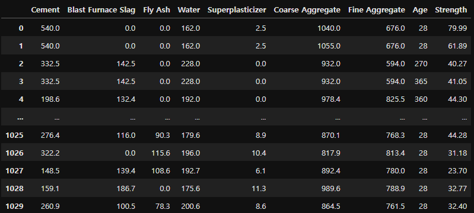
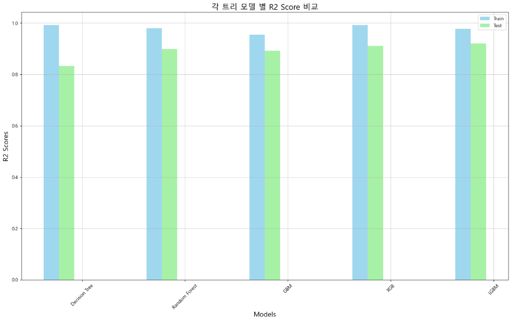
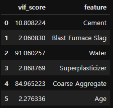
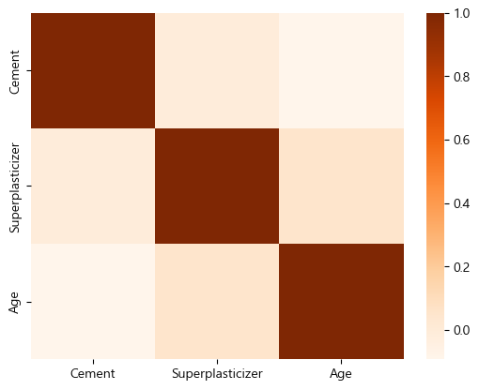

### 주제: 비선형 회귀를 통한 콘크리트 강도 예측 모델 학습


<sub>출처: https://www.nrmca.org/about-nrmca/about-concrete/</sub>

#### Features
- Cement: 시멘트 함유량
- Blast Furnace Slag: 용광로 내에서의 광재(광석 제련 후 남는 재)의 양
- Fly Ash: 먼지 발생량
- Water: 콘크리트를 만드는데 들어가는 물의 양
- Superplasticizer: 시멘트가 마른 뒤의 강성
- Coarse Aggregate: 시멘트 입자의 거친 정도
- Fine Aggregate: 시멘트의 고운 정도
- Age: 재보강이 필요해질 때까지 걸리는 시간

#### Target
- Strength: 콘크리트의 강도 (단위 /kN)

---

### 1st Cycle
- 전처리 없이 학습

전처리 이전의 데이터 세트는 다음과 같음



결측치 여부를 확인해봤지만, 이번 데이터 세트에서는 발견되지 않음

각 컬럼의 데이터 분포를 출력해본 결과는 아래와 같았으며,
타겟인 Strength의 데이터 분포는 첨도가 높지 않았기 때문에, 로그는 취하지 않기로 결정


feature 사이의 상관관계를 시각화 한 결과,
일부 feature 사이에 높은 음의 상관관계를 확인


#### 선형 회귀 모델로 학습

```
from sklearn.model_selection import train_test_split
from sklearn.linear_model import LinearRegression

# 데이터 세트 분할 후 선형 회귀 모델로 훈련
features, targets = c_df.iloc[:, :-1], c_df.iloc[:, -1]

X_train, X_test, y_train, y_test = \
train_test_split(features, targets, test_size=0.2, random_state=124)

l_r = LinearRegression()
l_r.fit(X_train, y_train)
```

데이터 세트를 분할한 뒤 Sklearn의 LinearRegression으로 학습,
모델의 성능과 과적합 여부를 알아보기 위해 train과 test 데이터를 같은 모델(l_r)로 예측한 결과는 다음과 같음


#### 1st Cycle - 선형 회귀 모델 학습 결과
- R2 Score가 우수하지 않고, train과 test 데이터 예측 결과 사이에  
  비교적 큰 차이를 보임에 따라 추가적인 전처리가 필요하다는 사실을 확인

---

### 2nd Cycle - 데이터 전처리

우선 중복 데이터가 발견되었기 때문에,
중복 데이터가 제거된 전처리용 데이터 세트, pre_c_df를 새롭게 생성함

그 후, feature들 사이의 상관관계를 확인한 결과는 아래와 같았으며,
전반적으로 이전 사이클과 큰 차이를 보이지 않음


#### 선형 회귀 모델로 학습

```
from sklearn.model_selection import train_test_split
from sklearn.linear_model import LinearRegression

# 데이터 세트 분할 후 선형 회귀 모델로 훈련
features, targets = pre_c_df.iloc[:, :-1], pre_c_df.iloc[:, -1]

X_train, X_test, y_train, y_test = \
train_test_split(features, targets, test_size=0.2, random_state=124)

l_r = LinearRegression()
l_r.fit(X_train, y_train)
```

이전 사이클과 같이 데이터 세트를 분할하고 선형 회귀 모델을 훈련,
train과 test 데이터의 평가를 시각화한 결과는 다음과 같음


#### 2nd Cycle - 선형 회귀 모델 학습 결과
- 이전 사이클에 비해 test 데이터의 R2가 향상된 것을 확인
- 데이터 표준화 후 이상치를 제거했을 때 생기는 변화와 비교해볼 것

---

### 3rd Cycle - 데이터 전처리
- StandardScaler()로 수치형 데이터 표준화
- 표준화 이후 수치가 -1.96 ~ 1.96이 아닌 데이터들 제거

```
from sklearn.preprocessing import StandardScaler

# 표준화 된 수치가 담긴 데이터 세트를 새로 생성
std = StandardScaler()
result = std.fit_transform(pre_c_df)
std_pre_c_df = pd.DataFrame(result, columns=pre_c_df.columns)

condition = True

# 반복문으로 각 컬럼에서 -1.96 ~ 1.96 사이의 데이터만 가져오는 조건식 생성
for column in std_pre_c_df.columns:
    condition &= std_pre_c_df[column].between(-1.96, 1.96)

# 위 조건에 맞지 않는 데이터 삭제
std_pre_c_df = std_pre_c_df[condition]

# pre_c_df에서 이상치가 없는 인덱스만 유지하고, 인덱스 초기화
pre_c_df = pre_c_df.iloc[std_pre_c_df.index].reset_index(drop=True)
pre_c_df
```

위 코드 실행 후, 약 720개의 데이터가 남았으며  
현재 데이터 분포와 feature 사이의 상관관계를 시각화


#### 선형 회귀 모델로 학습

이전 사이클과 같은 과정으로 모델을 학습시킨 뒤,
train과 test 데이터의 평가를 시각화 한 결과는 다음과 같음


#### 3rd Cycle - 선형 회귀 모델 학습 결과
- R2가 눈에 띄게 향상되었으며, 과적합 현상도 해소됨
- Polynomial, OLS, VIF 등을 활용해서 더욱 나은 성능의 모델을 구현해볼 것


#### Polynomial(다항 회귀) 학습

```
from sklearn.preprocessing import PolynomialFeatures

# 다항 회귀: degree는 차수를 의미함
poly_features = PolynomialFeatures(degree=2).fit_transform(features)
poly_features
```

Sklearn의 PolynomialFeatures로 기존 features를 변현한 poly_features를 생성  

다만, 차수가 3차 이상으로 늘어나면 오히려 모델 훈련 과정에서 오류가 발생했기 때문에  
이번 프로젝트에서의 다항 회귀는 2차식으로만 진행

poly_features를 활용하여 데이터 세트 분할 후, LinearRegression을 사용하여 모델 훈련  
그 후, train과 test 데이터의 평가를 시각화한 결과는 다음과 같음


#### 3rd Cycle - 다항 회귀 모델 학습 결과
- 회귀선의 차수가 2일 때 R2가 0.86까지 향상됨
- 아래에서 트리 회귀 모델 학습 결과와 비교 분석하면서 가장 높은 성능을 보인 모델 찾아보기


#### 트리 회귀 모델로 학습
- 이번 프로젝트에서는 Decision Tree, Random Forest, GBM, XGB, LGBM의 5가지 모델을 사용

```
# 아래 모델의 train, test 데이터 각각의 R2를 담을 빈 리스트 선언
train_r2 = []
test_r2 = []
```

학습에 앞서, 결과 시각화를 위해 모델 별 R2 Score를 담을 빈 리스트를 선언,
이는 이후 사이클에서도 동일한 과정으로 진행함

```
from sklearn.model_selection import train_test_split
from sklearn.tree import DecisionTreeRegressor
from sklearn.ensemble import RandomForestRegressor, GradientBoostingRegressor
from xgboost import XGBRegressor
from lightgbm import LGBMRegressor

# 데이터 세트 분할 후 선형 회귀 모델로 훈련
features, targets = pre_c_df.iloc[:, :-1], pre_c_df.iloc[:, -1]

X_train, X_test, y_train, y_test = \
train_test_split(features, targets, test_size=0.2, random_state=124)

# 회귀모델 선언
# 주의: poly랑 병행하지 말 것
dt_r = DecisionTreeRegressor(random_state=124)
rf_r = RandomForestRegressor(random_state=124, n_estimators=100)
gb_r = GradientBoostingRegressor(random_state=124)
xgb_r = XGBRegressor()
lgb_r = LGBMRegressor(n_estimators=100)

# 반복문으로 fit하기 위해 list 안에 담기
models = [dt_r, rf_r, gb_r, xgb_r, lgb_r]

# 위 모델들을 순차적으로 학습 후 결과 도출
for model in models:
    model.fit(X_train, y_train)
    print(model.__class__.__name__)
    print('-' * 40)
    
    print('Train 데이터 예측 결과')
    prediction = model.predict(X_train)
    get_evaluation(y_train, prediction)
    train_r2.append(r2_score(y_train, prediction))
    print('-' * 40)
    
    print('Test 데이터 예측 결과')
    prediction = model.predict(X_test)
    get_evaluation(y_test, prediction)
    test_r2.append(r2_score(y_test, prediction))
    print('=' * 80)
```

그 후 위 코드로 5가지 모델을 훈련시킨 결과,
각 모델의 R2는 다음과 같음



#### 3rd Cycle - 트리 회귀 모델 학습 결과
- 전반적으로 R2가 0.8 이상으로, 우수한 결과를 보여줌
- VIF로 다중 공선성 발생 여부 확인한 뒤,
  OLS 평가 결과와 같이 참고하여 다음 사이클에서 제거할 feature 선정


VIF와 OLS를 출력한 결과는 다음과 같았으며,  
이에 따라 다음 사이클에서는 Fine Aggregate를 제거하고 학습하기로 결정


---

### 4th Cycle
- corr(), VIF, OLS를 종합했을 때 삭제할 feature들
> - Fly Ash: Superplasticizer와의 상관관계가 높지만, 타겟과의 상관관계는 낮음
> - Fine Aggregate: target에 미치는 영향력이 낮음


### 4th Cycle - 데이터 전처리

Fly Ash와 Fine Aggregate를 제거했으며,
현재 각 feature 사이의 상관관계를 시각화한 결과는 다음과 같음


#### 선형 회귀 모델로 학습

이전 사이클과 같은 과정으로 모델을 학습시킨 뒤,
train과 test 데이터의 평가를 시각화 한 결과는 다음과 같음


#### 4th Cycle - 선형 회귀 모델 학습 결과
- 이전 사이클에 비해 R2가 약간 감소함
- 모델의 성능이 떨어졌거나, 비선형의 성격이 강해진 것이 원인으로 추정됨


#### Polynomial(다항 회귀) 학습

이전 사이클과 같은 과정으로 학습 후 결과 시각화


#### 4th Cycle - 다항 회귀 모델 학습 결과
- 마찬가지로 이전 사이클에 비해 R2가 약간 감소함


#### 트리 회귀 모델로 학습


#### 4th Cycle - 트리 회귀 모델 학습 결과
- 이전 사이클과는 다르게, XGB 회귀 모델의 R2가 가장 높게 측정됨

이전 사이클과 마찬가지로 VIF와 OLS를 출력해보았으며,
상관관계까지 고려해 다음 사이클에서는 Blast Furnace Slag와 Water를 제거하기로 결정




---

### 5th Cycle - 데이터 전처리
- 이전 사이클에서 사용한 데이터 세트를 기반으로 일부 feature 제거 후 테스트
> - Blast Furnace Slag: 타겟과의 상관관계 낮음
> - Water: VIF Score가 높고, Superplasticizer와 음의 상관관계 높음

이전 사이클과 마찬가지로 상관관계를 확인한 결과,
일부 feature들 사이에 존재했던 높은 상관관계가 해소된 것을 확인


이후 과정은 이전 사이클과 동일함


#### 선형 회귀 모델로 학습


#### 5th Cycle - 선형 회귀 모델 학습 결과
- 이전 사이클에 비해 R2 Score가 더욱 감소함
- 이는 타겟과의 상관관계가 높았던 Water를 제거해서 발생한 현상으로 추정


#### Polynomial(다항 회귀) 학습


#### 5th Cycle - 다항 회귀 모델 학습 결과
- R2가 0.85정도 측정됐던 이전 사이클에 비해 R2가 눈에 띄게 감소함


#### 트리 회귀 모델로 학습


#### 5th Cycle - 트리 회귀 모델 학습 결과
- 이전 사이클과 마찬가지로, XGB 회귀 모델의 R2가 가장 높게 측정됨
- 또한, 위의 모델 전부 R2가 0.85 이상의 우수한 수치를 보임
- VIF와 pairplot으로 다중 공선성이 남아있는지 확인해볼 것

이전 사이클과 마찬가지로 VIF와 OLS를 출력해보았으며,
다음 사이클에서는 Coarse Aggregate를 제거하기로 결정


---

### 6th Cycle - 데이터 전처리
- Coarse Aggregate 제거
- 만약 전반적으로 R2 Score가 떨어졌다면, 이전에 제거했던 Blast Furnace Slag를 복구하고 진행해볼 것

이전 사이클과 마찬가지로 상관관계를 확인




이후 과정은 이전 사이클과 동일함


#### 선형 회귀 모델로 학습


#### 6th Cycle - 선형 회귀 모델 학습 결과
- 이전 사이클에 비해 R2 Score가 약간 상승함
- 이는 다중 공선성이 발생한 Coarse Aggregate를 제거하면서 발생한 현상으로 추정


#### Polynomial(다항 회귀) 학습


#### 6th Cycle - 다항 회귀 모델 학습 결과
- 이전 사이클에 비해 R2가 약간 상승함


#### 트리 회귀 모델로 학습


#### 6th Cycle - 트리 회귀 모델 학습 결과
- 전반적으로 R2가 이전 사이클에 비해 크게 감소했으며,
  Decision Tree 모델에 과적합이 발생

VIF와 OLS 출력 결과 특별한 이상은 발견되지 않았으며,
다음 사이클에서 Blast Furnace Slag를 다시 추가하여 이번 사이클과의 결과를 비교해보기로 함


---

### 7th Cycle
- 만약 4 → 5번째 사이클로 넘어갈 때 Blast Furnace Slag를 제거하지 않았다면 R2가 지금보다 개선되었을까?
- 4번째 사이클에서 사용한 데이터 세트에서 Water와 Coarse Aggregate를 제거하고 이전 사이클과 결과 비교
> - 이전 사이클의 데이터에서 Blast Furnace Slag가 다시 추가되는 것


### 7th Cycle - 데이터 전처리
- Blast Furnace Slag 복구

이전 사이클과 마찬가지로 상관관계를 확인한 결과,
Cement와 Blast Furnace Slag 사이에 약 -0.3의 음의 상관관계가 발견됨


이후 과정은 이전 사이클과 동일함


#### 선형 회귀 모델로 학습


#### 7th Cycle - 선형 회귀 모델 학습 결과
- - 이전 사이클에 비해 R2 Score가 상승함


#### Polynomial(다항 회귀) 학습


#### 7th Cycle - 다항 회귀 모델 학습 결과
- 이전 사이클에 비해 R2가 약간 상슴


#### 트리 회귀 모델로 학습


#### 6th Cycle - 트리 회귀 모델 학습 결과
- 전반적으로 R2가 이전 사이클에 비해 상승함
- 가장 높은 R2를 보이는 XGB 회귀 모델의 경우, 0.91이라는 매우 우수한 수치가 관측됨
- 또한, Decision Tree 모델에서 발견괸 과적합 현상이 해소됨

VIF와 OLS 출력 결과, 이전 사이클과 마찬가지로 특별한 이상은 발견되지 않았으며,
이 시점에서 프로젝트를 종료하기로 함


---

### 최종 학습 결과
- Cement, Blast Furnace SLag, Superplasticizer, Age의 4개 feature를 가진 데이터 세트를 사용했을 때  
  가장 신뢰할 수 있으면서도, 전반적으로 0.7 이상의 높은 R2 Score를 기록하는 모델들을 얻을 수 있었다.
  
- 그 중에서도 XGB 회귀 모델의 경우, R2 Score 0.91로 매우 우수한 결과를 보여주었다.

- 6번째와 7번째 사이클을 비교했을 때, 타겟과의 상관관계가 낮다고 무작정 제거하는 것이 아니라  
  해당 feature의 다중 공선성 발생 여부도 고려하여 제거할 feature를 선별하는 것이 좋다는 것을 알 수 있었다.

